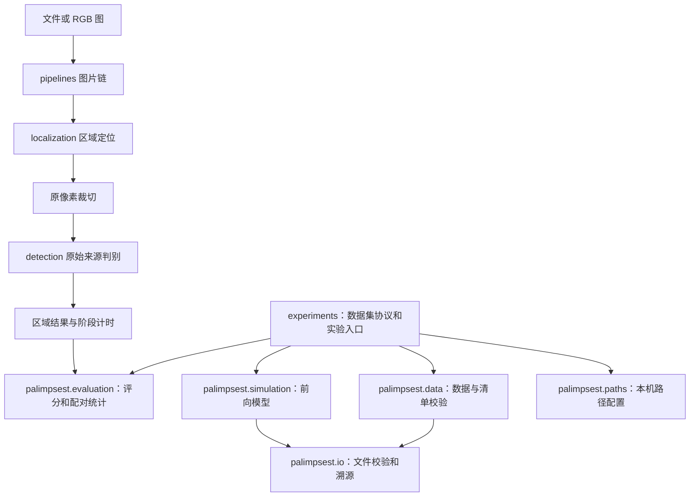

# Palimpsest 代码结构

[仓库首页](../README.md) · [来源推理接入](detection_pipeline.md) · [研究结论](../reports/README.md)

## 完整任务与能力边界

给定经过未知传播的图像，判断原始内容来自自然摄影还是 AI。`localization` 负责区域定位，`detection` 负责来源判别，`pipelines` 串接解码、定位、原像素裁切和来源推理，`simulation` 支持处理机制与鲁棒性研究。

| 模块 | 当前状态 |
|---|---|
| [contracts](../src/palimpsest/contracts.py) | RGB、Box、Region、Prediction：坐标、标签、分数方向、阈值与计时 |
| [localization](../src/palimpsest/localization/README.md) | 四边形提议、SAM 2 自动分割已接入；图像表面筛选与跟踪待开发 |
| [detection](../src/palimpsest/detection/README.md) | B-Free/D3 推理、Benford 特征与森林导出/加载；自研 algorithms/models 待开发 |
| [pipelines](../src/palimpsest/pipelines/README.md) | 图片链可调用；视频/手机实时应用待开发 |
| [training](../src/palimpsest/training/README.md) | 训练/标定协议预留，无默认训练器，本轮不训练研究模型 |

定位和来源模块共用 contracts，彼此不导入。前向模拟不依赖真假标签选择参数，组合来源推理不偷偷执行模拟。未实现的目录提供职责与协议，不制造预测。

## 依赖方向

公共库不导入实验脚本，不读取真假标签来选择模拟参数。`tools/check_layout.py` 检查库对实验目录的依赖、内部模块/符号和文档链接。

## 公共模块

| 模块 | 职责 | 边界 |
|---|---|---|
| [simulation](../src/palimpsest/simulation/__init__.py) | 显示、光学、传感器、ISP、打印扫描和发布编码 | 物理与数值假设；不负责划分数据集 |
| [data/inference.py](../src/palimpsest/data/inference.py) | 推理结果与清单的顺序、身份、完整性和有限分数校验 | 不证明训练无重叠或物理标签真实 |
| [data/images.py](../src/palimpsest/data/images.py) | 有明确插值和数值范围的图像变换 | 不代替物理模拟或检测器预处理 |
| [data/video.py](../src/palimpsest/data/video.py)、[raw2event.py](../src/palimpsest/data/raw2event.py) | 帧解码、时间戳与发布尺寸/标记约定 | ffmpeg/ffprobe 为显式运行依赖；不把发布约定当设备物理参数 |
| [data/cifar10.py](../src/palimpsest/data/cifar10.py)、[rr.py](../src/palimpsest/data/rr.py) | 数字来源像素、已知精确重叠排除及 RR 配对 | CIFAR pickle 仅用于受信任档案；不证明近重复已排除 |
| [evaluation/image_pairs.py](../src/palimpsest/evaluation/image_pairs.py) | 亮度关联、颜色变化、梯度能量比 | 使用既定粗粒度图像，不负责配准 |
| [evaluation/classification.py](../src/palimpsest/evaluation/classification.py) | AUC、固定零阈值 BA、真假类准确率、来源级 bootstrap | 保留已有 FAKE-positive、严格 `score > 0` 口径 |
| [evaluation/pairing.py](../src/palimpsest/evaluation/pairing.py) | 同源条件变化、翻转率、来源配对区间 | 仅对来源交集计算，报告未配对数量 |
| [evaluation/timing.py](../src/palimpsest/evaluation/timing.py) | 延迟分位数及解码/预处理阶段统计 | 拒绝负值和非有限时间 |
| [evaluation/distribution.py](../src/palimpsest/evaluation/distribution.py) | 配对图像诊断的描述性分位数 | 不把分布相似等同于物理正确 |
| [io](../src/palimpsest/io/__init__.py) | 流式 SHA-256、CSV、模型源代码指纹 | 不修改已存结果或历史指纹 |
| [io/remote_zip.py](../src/palimpsest/io/remote_zip.py) | HTTP Range、缓存/分块读取、ZIP 成员长度与 CRC | 严格校验 Range；URL 与来源选择留在数据准备 |
| [paths.py](../src/palimpsest/paths.py) | 数据与产物的可移植路径配置 | 加载配置不产生 I/O 副作用 |

## 实验和产物

`experiments/<领域>/<问题>/<数据范围>/` 保留数据集选择、冻结划分、参数拟合和具体分析。入口按执行角色命名，问题内共享步骤进入 `protocol.py`，详见[工作流约定](experiment_conventions.md)。新发现的通用能力先提取到公共库，再由实验调用。协议不同的归一化、频谱窗和拟合目标不因名称相似就合并。

`work/` 保存历史结果、日志和第三方代码；`reports/` 保存研究报告与图。历史复算路径保持稳定，不将已签发结果搬入新的任意目录。

新增实验应显式记录配置、输入清单及指纹、代码版本、随机种子、指标和日志。此前审查发现的顶层研究操作已移到显式入口，维护检查和无数据导入测试覆盖这些边界。当前未实现统一实验调度器；不要批量运行历史脚本。

## 扩展与复算

Python 使用 `src` 布局。核心命令为 `palimpsest-render`、`palimpsest-simulate`、`palimpsest-capture-kit`、`palimpsest-detect`。来源推理的依赖、协议与命令见[接入指南](detection_pipeline.md)。

旧命名空间与入口私有助手转发已移除，调用直接引用实现模块。新增定位器实现 `RegionLocator`；新增传统/神经来源检测器实现 `OriginDetector`。阈值标定、掩膜处理、透视校正或聚合策略需要独立验证，不能悄悄作为默认处理。

重构改变代码路径和指纹，旧缓存不能视作新代码运行结果。要精确恢复旧实验，使用报告记录的历史 Git 版本与原依赖环境。
