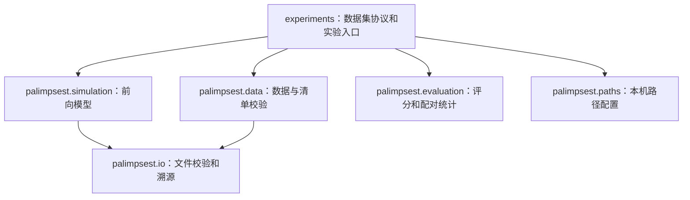

# Palimpsest 代码结构

[仓库首页](../README.md) · [开发与复算](README.md) · [研究结论](../reports/README.md)

## 依赖方向

公共库不导入实验脚本，不读取真假标签来选择模拟参数。`tools/check_layout.py` 检查库对实验目录的依赖、内部模块/符号和文档链接。

## 公共模块

| 模块 | 职责 | 边界 |
|---|---|---|
| [simulation](../src/palimpsest/simulation/__init__.py) | 显示、光学、传感器、ISP、打印扫描和发布编码 | 物理与数值假设；不负责划分数据集 |
| [data/inference.py](../src/palimpsest/data/inference.py) | 推理结果与清单的顺序、身份、完整性和有限分数校验 | 不证明训练无重叠或物理标签真实 |
| [data/images.py](../src/palimpsest/data/images.py) | 有明确插值和数值范围的图像变换 | 不代替物理模拟或检测器预处理 |
| [evaluation/classification.py](../src/palimpsest/evaluation/classification.py) | AUC、固定零阈值 BA、真假类准确率、来源级 bootstrap | 保留已有 FAKE-positive、严格 `score > 0` 口径 |
| [evaluation/pairing.py](../src/palimpsest/evaluation/pairing.py) | 同源条件变化、翻转率、来源配对区间 | 仅对来源交集计算，报告未配对数量 |
| [evaluation/timing.py](../src/palimpsest/evaluation/timing.py) | 延迟分位数及解码/预处理阶段统计 | 拒绝负值和非有限时间 |
| [evaluation/distribution.py](../src/palimpsest/evaluation/distribution.py) | 配对图像诊断的描述性分位数 | 不把分布相似等同于物理正确 |
| [io](../src/palimpsest/io/__init__.py) | 流式 SHA-256、CSV、模型源代码指纹 | 不修改已存结果或历史指纹 |
| [paths.py](../src/palimpsest/paths.py) | 数据与产物的可移植路径配置 | 加载配置不产生 I/O 副作用 |

## 实验和产物

`experiments/<主题>/` 保留数据集选择、冻结划分、参数拟合和具体分析。新发现的通用能力先提取到公共库，再由实验调用。协议不同的归一化、频谱窗和拟合目标不因名称相似就合并。

`work/` 保存历史结果、日志和第三方代码；`reports/` 保存研究报告与图。历史复算路径保持稳定，不将已签发结果搬入新的任意目录。

新增实验应显式记录配置、输入清单及指纹、代码版本、随机种子、指标和日志。当前未实现统一实验调度器，部分历史脚本仍在模块顶层读取本机结果；不要批量导入或运行它们。

## 安装和兼容

Python 使用 `src` 布局，需要先 `uv sync --locked --extra dev`。标准命令为 `palimpsest-render`、`palimpsest-pipeline`、`palimpsest-capture-kit`。

[origin_simulation](../src/origin_simulation/__init__.py) 仅为历史模块命令保留 namespace 入口，没有第二份模拟实现。新代码和当前文档使用 `palimpsest.simulation`。

重构改变代码路径和指纹，旧缓存不能视作新代码运行结果。要精确恢复旧实验，使用报告记录的历史 Git 版本与原依赖环境。
