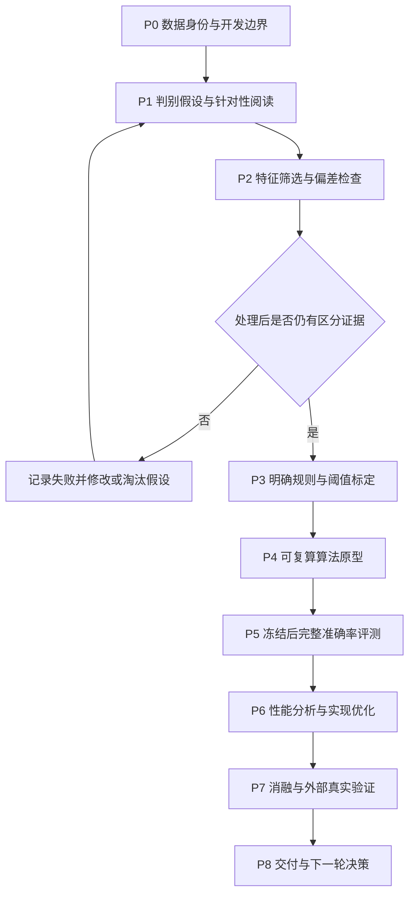

# 经过未知处理后的 AI／非 AI 判别算法：研发流程

日期：2026-10-05。整理：Lady。阶段：**设计**。本文件是开发计划，不是已实现算法或性能报告。

[仓库首页](../README.md) · [自研算法位置](../src/palimpsest/detection/algorithms/README.md) · [现有 baseline](../experiments/origin_detection/baselines/README.md) · [研究记录](../reports/README.md)

## 1. 任务、范围与完成条件

输入只有最终看到的一张图，不提供原图、平台、处理链或设备参数。输出 AI／非 AI 分数与判定。AI 图片经过拍屏、扫描或 JPEG 重存后，其 AI 标签仍保留。当前数据的非 AI 对照主要是自然摄影；不能把结果扩展成对所有绘画、传统 CGI、混合编辑图的有效性。

本轮研发**非深度学习的显式算法**：手工统计特征、明确的归一化与聚合规则、有限的参数/阈值标定。标定使用标签就必须如实记录，不能称为完全不依赖学习。大型视觉骨干、神经模型训练、手机演示和新的 simulation 研发不属于这一阶段。

目标有三项，必须同时报告：

1. 处理后的绝对判别能力，包括自然类与 AI 类。
2. 相对同源原图的准确率下降和条件之间的差异。
3. 单图计算成本，尤其包含文件解码与预处理的 CPU 延迟。

分数变化小或准确率跌幅小本身不算成功；恒猜自然图也很稳定。把高频全部抹掉不能视作找到了稳健信号。极端信息丢失下的普遍准确性不作为承诺；需要记录当前证据支持的处理与输入范围。

### 项目目标与验收的区别

用户目标是高准确率、下降极小且快速。本计划不把未测得的性能写成完成条件已通过，也不先宣布能够超过 B-Free。

- **信号成立：**在算法验证来源中，候选在平台传播和混合再数字化两个条件均有超随机区分证据，且不是编码/尺寸捷径。候选方向只在开发样本上确定。
- **原型可用：**可对所有有效输入产生有限分数，参数可保存/加载，接入共用接口，完整记录错误和耗时。
- **性能改善：**在冻结评测来源上，与同来源 baseline 做配对比较；是否改善、改善多少，由实际区间和各类正确率决定。
- **泛化成立：**需进一步获得未用于方法开发的真实来源/设备数据；既有 RR、Chimera 上的成绩不足以自动通过此项。

建议的首轮工程预算：特征与判别核心 P95 ≤10 ms，文件端到端 P95 ≤50 ms，限明确的 CPU、线程数与 ≤2MP 输入档位。**这是待验证的设计预算，不是当前速度，不适用于 RR 超大图，也不代表手机摄像头端到端帧率。**不满足时先报告瓶颈，不能通过丢弃慢图改变结论。

## 2. 已有资源、失败证据与不能直接复用的结论

| 资源 | 当前已有内容 | 开发时怎么用 |
|---|---|---|
| B-Free、D3 | 官方权重适配与 RR 全量缓存分数 | 性能参考；新算法用相同来源比较，不重复原全量推理 |
| Benford-RF | 手工 DCT 特征、森林推理/保存接口、旧全量分数 | 传统方法参考；旧拟合森林未保存，新图运行需要另行拟合并保存 |
| Fourier＋5-NN | 实验实现、600来源×3条件的 pilot | 已知失败参考；不是全量结果或通用算法适配器 |
| RRDataset | 原图、作者发布的平台传播图、混合再数字化图与配对清单 | 内部开发与历史基准复算；四物理方式无逐图标签 |
| Chimera | 1,200来源×原图/Mac拍屏/LG拍屏；已有 B-Free 分数 | 真实拍屏对照；只有部分内容和生成器，且已参与前期探索 |
| evaluation | 分类、同源配对、缓存审计与延迟汇总 | 直接复用；没有必要新写一套 AUC/BA 工具 |

已核对的本机结果见 [RR 统一报告](../reports/02_数据与基线/RR统一评测与数字传播对照_2026-10-05.md) 的“全量 baseline”、[Fourier pilot](../reports/90_历史探索/非深度学习基线筛选与傅里叶小样本验证_2026-09-24.md) 第3节、[Chimera 报告](../reports/02_数据与基线/Chimera真实拍屏_B-Free外部配对Baseline_2026-09-25.md) 的“固定权重、整集单图结果”。它们是历史测量，不是本轮重新计算。

特别注意两项已知风险：

- [RR 审计](../reports/02_数据与基线/数据集整理与Baseline准入审计_2026-09-23.md) 第12、17节表明文件格式与标签强相关。算法不得读取扩展名、JPEG头、来源文件名或路径作为 AI 证据；仅转成数组仍可能保留原有压缩残余，需要额外检查。
- 历史 Fourier 适配在处理后接近随机判别。它否定的是这个实现和这组样本上的效果，不是所有频域路线；也不应原样重做再期待不同结论。

## 3. 总体顺序与阶段产物



| 阶段 | 做什么 | 必须留下的产物 | 进入下一阶段的条件 |
|---|---|---|---|
| P0 | 审计身份、重复、历史用途与新划分 | 来源角色清单、排除理由、基准可比较来源 | 没有来源组泄漏；无法证明的独立性已标注 |
| P1 | 提出≤3个候选特征族并核查原理 | 假设卡、原始来源与失败条件 | 每个候选都能被真实处理样本否定 |
| P2 | 比较单特征/特征族的区分与稳定性 | 分条件指标、偏差负对照、成本 | 有至少一条候选值得组合，否则停止扩展 |
| P3 | 固定预处理、特征、聚合和单一阈值 | 可读算法说明、参数文件及标定记录 | 不需要目标原图或真实处理标签来推理 |
| P4 | 接入 OriginDetector 与评测链 | 可调用实现、关键行为验证、运行清单 | 分数/标签/计时/参数加载语义一致 |
| P5 | 冻结版本后完整运行 | 逐图分数、覆盖审计、配对 baseline 对照 | 无遗漏/静默失败；结果不用于回调该冻结版本 |
| P6 | 找出解码、预处理、特征和聚合瓶颈 | 硬件与线程记录、分档延迟、优化前后一致性 | 准确率变化与速度变化分别交代 |
| P7 | 消融、捷径反证、外部数据验证 | 哪个组件有效、适用边界、未通过项 | 主张只覆盖实际验证的条件 |
| P8 | 判断继续、缩减、换路线或保留失败 | 可复算说明、阶段总结、下一轮假设 | 没有把原型或 pilot 写成最终完成 |

本次只完成流程设计。下一次从 P0/P1 开始，不直接计算整套候选，更不重跑已有深度 baseline。

## 4. P0：数据先保证比较可信

### 4.1 以来源组划分

一张原图及所有真实/数字处理版本必须归属同一来源组，并放在同一个开发或评测角色中。不能将原图用于标定、同源拍屏图用于测试。标定集、选择集、阈值验证集与冻结评测集分开记录；数据有限时可在开发来源内部做按组交叉验证，不把图像版本随机拆开。

清单至少包括：`source_group`、`filename`、`origin`、`condition`、`dataset`、`split_role`、原图/文件SHA、配对状态、已知生成器/设备字段、历史使用情况、排除理由。未知字段明确为空，不从 JPEG 采样或文件名主题推断物理方式/生成器。

### 4.2 继承历史使用边界

RR test 的总体结果、部分逐图结果和图像已参与前期研究，Chimera 也参与过模拟探索。它们属于**既有公开基准/项目内部研究数据**，不得通过换名获得“全新盲测”身份。

- 先核对旧 `rr_simulation_source_registry.csv`，历史 development/prior 可作为已暴露的处理探索来源；不能重新分配 reserved 来调参。
- 原图参数估计可使用已审计的 RR train；官方 val 也需完成来源/重复检查，不能只因目录名叫 val 就信任它。
- 为算法建立独立用途清单，引用旧角色与使用历史，不覆盖 simulation 的冻结 registry。
- 新算法选择/标定中实际使用过的 RR 来源，必须从该算法的评测主子集中按整个来源组排除。继承14个已知 train/val 精确重叠排除，并增加新发现的重复。
- 旧 reserved 仍只允许事后内部留出评测，不能用于参数选择。不能据此宣称跨数据集/跨设备泛化已成立。
- 已用于算法探索的 Chimera 组只作开发/诊断，其余未用于算法标定的组可作冻结对照；整个项目此前使用过它，独立性限制仍需写明。

当前历史全量为50,957张。若新算法的开发使用了其中来源，**该数目不能直接成为其无泄漏主测试规模**。可以保留同清单全量诊断，但主比较应使用重新签发、排除算法开发来源后的子集，并从已有 baseline CSV 复算同子集。不要拿新子集算法结果与旧全量 baseline 表直接作优劣比较。

### 4.3 重复与数据捷径审计

1. 检查原图SHA与整个来源组的角色交叉。
2. 感知哈希/粗内容匹配只用于提出近重复候选，不自动将所有相似主题合并。无法确认的组标记为疑似并做敏感性分析。
3. 核对每个条件的真假类数量、尺寸、原始格式、内容主题分布。
4. 为编码负对照准备同样的无损保存或统一 JPEG 重编码。PNG 保存不能消除原有 JPEG 痕迹，因此两种检查需要区别解释。
5. 主检测器仅接受像素；元数据规则单列为偏差检测器。若内容/主题捷径仍明显，增加匹配分层和外部验证，不能靠改名消除它。

**P0 结束：**来源与角色可追踪、泄漏排除可复算、旧结果可在新比较子集重汇总。不会声称已经获得完全独立的新测试集。

## 5. P1：先写假设，再写特征

每个候选填写一张假设卡：候选名、来源依据、特征定义、可能保留的处理、可能失效的处理、预期计算量、偏差风险、正/负对照与淘汰条件。

首轮建议三类候选，均是**待验证假设**：

| 候选族 | 初步计算构思 | 为什么值得试 | 必须防止的错误解释 |
|---|---|---|---|
| 局部归一化的邻域统计 | 在固定小块内计算归一化一/二阶差分、不同间距邻域相关与少量共现摘要 | 成本可控，可以直接研究哪些尺度在传播后保留差异 | 可能只是内容纹理、JPEG块或重拍噪声差异 |
| 跨尺度结构统计 | 在两个固定尺度比较边缘/局部能量/相关性，而非只看最高频尾部 | 给出与单尺度高频不同的假设 | 尺度归一化不等于数学不变性；缩放本身可能造线索 |
| 亮度—色度的局部关系 | 经局部归一化比较边缘附近的通道关系与少量联合统计 | 与纯灰度线索可能互补 | 拍屏/ISP/色度采样也会改变它，不能用“有色偏”直接判AI |

不预先认定低频、中频、颜色或自然图统计就是所有生成器的共同指纹。PRNU/CFA存在只说明最终相机可能参与过成像，不能直接证明屏幕内内容是自然摄影。拍屏检测与AI检测是两个问题。

文献工作服务于假设：核对原始构造、参数、数据范围、压缩失败和反例。手工特征本身、跨尺度和稳健聚合都不先宣称创新。近期手工特征研究已经存在；项目潜在贡献需要由处理后的真实结果与速度证明。

**P1 结束：**每类有明确失败条件，最多三类进入 P2；如果只能写出“看起来会更稳健”，继续补定义而非开始大规模运行。

## 6. P2：筛选的对象是处理后的可分性

### 6.1 控制首轮搜索规模

- 最多三类特征、两种预处理策略；先分别测，不立刻全部拼接。
- 诊断样本可用数百至1,000个已暴露来源组，并保持同源条件配对；它是筛选规模，不是最终评测规模。
- 预处理窗口、插值、颜色空间、方向处理、常量图处理和随机种子在运行前记录。
- 首轮建议总计最多4个256×256分析小块、最多两个尺度，总小块数量不随尺度翻倍。它是工程起点，仍需在开发集检查裁切/放大造成的偏差。
- 每个版本缓存一次明确的特征表，记录配置与代码SHA；禁止参数不同的结果复用同一缓存。

### 6.2 同时看三类量

1. **区分能力：**每个条件单独看 AUC、候选规则的BA及真假类正确率，方向只在标定来源上确定。
2. **同源变化：**特征/分数变化与跨阈值错误；稳定但两类混在一起的特征淘汰。
3. **成本：**特征耗时、维度、内存；保留有独立增益且成本可接受的候选。

可以画每类特征在各条件下的分布与同源变化，但整体一维分布相似不能代替条件可分性。特征筛选本身用到了标签，必须登记其使用来源。

### 6.3 能否证伪的检查

- 常数分数/恒猜一类：排序AUC与BA应显示没有判别力，不能因跌幅为零通过。
- 在开发来源中置乱标签：来源组整体置乱，防止同源版本共享标签造成伪关联；一次随机实验不用于证明独立性。
- 不改像素只改文件名/路径：公共检测器结果应保持一致。
- 编码统一、尺寸与内容分层：检查候选收益是否主要来自格式和分辨率。
- 若可得到已知生成器/设备标签，按这些组验证；缺失时写“无法实施”，不根据目录主题代替它们。

建议首轮有限尝试上限：三类×两种预处理，再加必要的单项消融与对照；所有尝试记入同一记录。若两轮修改后仍未在两个处理验证条件上获得可重复的区分证据，保留失败并换假设，不继续无上限叠特征或改阈值。

## 7. P3：把信号变成明确算法

首个版本采用显式统计规则。可考虑下面的标定形式，但公式参数需由 P2 的结果决定：

1. 提取少量已通过筛选的特征 `phi_j`。
2. 用标定来源估计中位数与 MAD 尺度，零尺度有明确处理。
3. 用标定来源决定每个特征的方向 `d_j`，较大的最终分数统一表示更偏AI。
4. 单块分数采用有文档定义的归一化特征聚合；首轮从等权开始，不先搜索大量权重。
5. 多块分数采用中位数或另一个预先记录的稳健聚合；有纹理/有效块筛选时必须报告被筛掉多少与两类影响。
6. 在独立阈值验证来源上选择一个全局阈值；部署时不读取真实条件来换阈值。

示意：`z_j=(phi_j-median_j)/max(MAD_j, epsilon)`，`score_patch=mean(d_j*z_j)`，`score_image=median(score_patch)`，`score_image > threshold` 判AI。这是**候选形式**，不是已开发的新算法，也不是完全不使用标签的算法。

阈值目标建议为提升平台传播/混合再数字化验证条件中较差一项的BA，同时报告自然类误报和AI类召回。阈值候选、选择目标、并列时的处理、验证来源在选择前固定；不能在 RR/Chimera 最终对照结果上反向修阈值或翻转分数。

浅层逻辑回归、RF或其他学习分类器可在后续作为“同特征能否被简单分类器利用”的对照，单独登记；首个规则算法不悄悄切换为它们。若规则组合失败而分类器成功，按实际方法报告，不用“纯算法”掩盖拟合。

**P3 结束：**算法步骤、所有拟合统计量、阈值及出处可读、可保存，推理只需最终图像。

## 8. P4：实现与仓库落点

以下是后续实现规划，带“拟新增”的路径当前没有实现：

```text
src/palimpsest/detection/algorithms/
  <method>/                   拟新增，按验证后的构造命名
    features.py               单一特征实现，多处复用
    detector.py               OriginDetector 与参数加载
experiments/origin_detection/robust_statistics/
  protocol.py                 拟新增，固定开发/比较协议
  audit_sources.py            拟新增，用途/覆盖/重复审计
  evaluate_features.py        拟新增，特征诊断
  fit_rule.py                 拟新增，统计量与阈值标定
  run_algorithm.py            拟新增，显式批量推理
  benchmark_algorithm.py      拟新增，速度协议
configs/evaluation/
  <protocol>.toml              拟新增，一份可追踪配置
tests/detection/               按实际风险添加验证
work/<protocol>/<run>/         特征、参数、逐图结果和日志，不提交Git
reports/                      精炼的阶段证据，失败也保留
```

实现 [OriginDetector](../src/palimpsest/detection/interfaces.py)，接受非空uint8 RGB；使用 [Prediction](../src/palimpsest/contracts.py) 输出有限分数、声明的阈值、计时与参数指纹。复用 [files.py](../src/palimpsest/detection/files.py) 的文件解码计时、[classification](../src/palimpsest/evaluation/classification.py)、[pairing](../src/palimpsest/evaluation/pairing.py)、[timing](../src/palimpsest/evaluation/timing.py) 与 [cached](../src/palimpsest/evaluation/cached.py) 的评测能力。

不另建来源标签或AUC工具；不复制同一特征到拟合和推理入口；数据集路径/划分不进入公共算法。未标定的统计分数不称概率。错误、有效小块不足和异常尺寸要显式处理，不能丢弃失败样本后只报成功图的准确率。

必要验证包括：参数保存/加载一致、常量图与极小图边界、推理不读取路径/标签、图像ID错位被评测拒绝、已知方向/频率输入用于检查相应特征行为。软件验证只证明实现行为，不证明AI识别有效。没有必要给每个可逆重构写镜像测试。

BootLoops工具索引已查阅，本轮未选择计算包。后续若调用其工具，先读完整GUIDE与本机PASS/SKIP/REFUSED/FAIL记录，通过WSL环境入口执行，输出留在本项目；缺少验证记录不得写“已可用”。项目已有ML评测接口优先复用，工具安装自测试不构成算法科学证据。

## 9. P5：冻结后的完整性能评测

冻结输入清单、代码提交、依赖、参数、阈值和评价口径，然后执行候选算法。分类主结果**不采用仅600张的筛选结论**。

### 9.1 条件矩阵

| 数据与条件 | 目的 | 限制 |
|---|---|---|
| RR原图 | 参照与捷径检查 | 主目标不是这一列高分 |
| RR平台传播 | 实际发布传播后的判别 | 逐图平台/轮数缺失，不能按猜测标签分层 |
| RR混合再数字化 | 多种真实再成像后的判别 | 不能称单独拍屏准确率 |
| Chimera原图/Mac/LG拍屏 | 具体真实拍屏对照 | 内容/生成器/设备覆盖有限，已有研究使用历史 |
| 已有简单数字算子的诊断 | 检查处理强度与组合失效 | 仅辅助分析，不替代真实主结果、不恢复simulation研发 |
| 后续未参与开发的真实数据 | 泛化验证 | 当前没有因此自动具备新数据；列为待完成 |

有标签才能作对应分层；不存在的设备、生成器或物理方式标签不补造。

### 9.2 指标与统计单位

- 每个条件：BA、AUC、自然类正确率、AI类正确率、样本/来源数。
- 同源共同子集：处理后BA减原图BA、原图判对后变错/反向改善数量；缺配对另列。
- 主要鲁棒性摘要：**处理条件中最差BA**，同时列各条件绝对值；不让容易条件掩盖再数字化失败。
- 与baseline：相同来源、相同条件的BA/AUC差值和来源级配对区间，单一全局阈值。
- 拒判若后续添加：另报覆盖率及覆盖—风险，主二分类结果不靠拒判提高。
- 置信区间按来源组重采样，同源各版本一起抽取；类别分层，种子与重复次数固定（建议延用2,000次）。pilot上反复挑选的最好区间不用于确证主张。
- 独立指标实现核对用于软件正确性，不把共享标签/样本的两套指标实现称为独立科学验证。

复用 B-Free/D3/Benford 的已完成逐图分数，在算法实际比较子集重新汇总。保留它们历史阈值与协议，不因新算法结果改变对照。若另做同验证集阈值标定的baseline表，必须与历史固定阈值表分开报告。

**P5 结束：**唯一文件名、清单覆盖、标签、有限分数、错误与条件数量全部核对；得到完整结果即使不好也交付。冻结评测中发现的问题进入下一版本，旧结果与其用途记录保留；已看过的评测来源不能重新称为未见验证。

## 10. P6：速度是独立的实测轴

先分解，再优化：文件读取/解码 → 像素预处理 → 小块选择 → 特征 → 聚合/判定。统计核心与文件端到端分别报告，不能只报数组上的几毫秒。

协议记录CPU型号、电源模式、线程数、库版本、预热、输入尺寸/编码、重复次数、磁盘缓存状态。单图batch=1；随机化不同方法的测量顺序，在相同输入上测量。至少区分小图、≤2MP、较大图与RR极大图，不把容易图的速度称为全量速度。

B-Free/D3历史记录是GPU协议，Benford为CPU；可作各自部署成本参考，不作同硬件速度排名。需要公平速度对照时，冻结一个代表性输入子集重新测耗时，而不是再跑全量准确率；设备不支持的后端明确缺测。

优先优化重复解码、重复颜色转换、Python逐像素循环和多余数组拷贝。缓存FFT窗口/固定索引、向量化与小块数量限制都要核对结果。改变输入分辨率、采样策略、精度或特征定义属于新算法版本，需要重新检查准确率。

## 11. P7：收益归因、反证与停止条件

只围绕有证据的组件做消融：单尺度/双尺度、单块/多块、是否局部归一化、每类特征单用/组合、规则标定/固定规则。报告准确率变化与每项成本；不把整个配置笛卡尔积作为默认任务。

优先核查：是否仅识别JPEG历史、是否仅识别是否拍屏、某内容主题是否决定分数、某设备噪声是否被误当作自然来源、低纹理与极低分辨率是否系统失败。

当候选没有真实处理后的区分证据，或所有增益都能由编码/主题解释，停止此候选并记录失败。若只能在RR上改善，就报告RR内部结果；若只在一种设备有效，就报告该设备范围。若高精度必须依赖更强学习器，先总结规则算法极限，再单独规划模型路线。

## 12. P8：每次迭代的交付与执行纪律

每轮交付一份短报告：问题与假设、实际用过的来源/角色、候选与尝试次数、配置/代码/参数指纹、真实条件逐项结果、速度、失败与下一轮唯一改动。原始逐图结果与参数保持可追踪。

结果记录追加；历史报告的数值与口径不改写。导航与当前状态可更新。新结论必须指向其receipt，不能从早期设想升级而来。

需要长任务时使用有明确日志、PID、退出状态与恢复校验的显式运行；不由导入或README示例自动启动。执行结束确认子进程退出。用户已经暂停simulation，不因此另设定时探索或启动模拟/训练任务。

里程碑按产物判断，不先承诺日历时间：**P0/P1准入说明 → P2筛选证据 → P3/P4可跑原型 → P5完整对照 → P6/P7准确率—速度与边界 → P8下一步。**发现阻塞时说明具体缺什么；独立数据缺口限制泛化主张，不阻止已暴露数据上的原型开发。

## 13. 本轮来源核查与欠账

本轮是支持开发计划的定向检索，不是完整的新颖性综述。没有提出“首次”“领先”或已找到普适判别信号的主张。

### 13.1 已核对的记录

| 原始记录与版本 | 已打开的定位 | 对计划的支持 | 阅读状态 |
|---|---|---|---|
| [Dzanic、Shah、Witherden，NeurIPS 2020](https://proceedings.neurips.cc/paper/2020/file/1f8d87e1161af68b81bace188a1ec624-Paper.pdf) | §2.3.2、§3.1.2、Table2，PDF第4/6页 | 5NN高频路线；作者报告压缩会削弱线索，不能作为普适指纹 | 原文相关页已核查；全篇逐段阅读未完成，后续页重开返回错误 |
| [Chandrasegaran、Tran、Cheung，arXiv:2103.17195v1](https://arxiv.org/html/2103.17195) | Abstract、§4、§5及Supplementary C | 末次上采样改变可形成频谱反例；频谱差异不应视作所有生成器固有属性 | 相关正文已核查，完整逐段审阅/引用链待完成 |
| [Nirob等，arXiv:2601.19262v1，2026-01-27](https://arxiv.org/html/2601.19262) | §IV-A/B、§VI | 手工特征已有相关工作；该论文明确其跨域/跨数据集验证限制 | 相关正文已核查，完整逐段审阅待完成 |
| [RRDataset论文，arXiv:2509.09172 HTML](https://arxiv.org/html/2509.09172) | §3.3.1/2、Table1 | 作者报告多轮真实平台发送与四种再数字化；支持分别评测处理条件 | 相关数据构造节已核查；发布包的逐图标签不足由本机审计补充 |
| [Bonettini等，arXiv:2004.07682](https://arxiv.org/abs/2004.07682) | 官方摘要页；本机代码与历史报告另有审计 | 作为Benford参考入口 | 本轮摘要核对；全文阅读未完成，不据此新增性能主张 |

便于复核的短句：Dzanic §3.1.2 原文“compression, even in small amounts, acts to homogenize”；Chandrasegaran Abstract 原文“are not inherent characteristics”；Nirob §VI 原文“did not study robustness across domains”。这些限定保留在本计划中，不把候选机制升级为已证实的稳健性。

### 13.2 实际检索与后续任务

2026-10-05，经web搜索运行以下查询：

1. `2026 AI generated image detection handcrafted features JPEG recapture non deep learning`
2. `Fourier Spectrum Discrepancies Deep Network Generated Images JPEG compression Dzanic 2020`
3. `On the use of Benford law detect GAN generated images Bonettini 2004.07682`
4. `site.arxiv.org image AI detection impossible downsampling compression information loss robust 2025 2026`

实际打开NeurIPS原PDF与上述arXiv原始记录。二级网站、论坛内容不作为方法有效性的依据。没有完成Scholar/Semantic Scholar/OpenAlex交叉检索、所有作者近期作品扫描或双向引用链；没有迭代到检索干涸，因此不能称综述完整。后续P1按选中假设补全文和链条，不为列阅读清单而扩展整个项目。

工具方面，已打开WSL `Ubuntu-24.04` 下 `/root/.local/share/bootloops-suite/bootloops/tools/README.md` 和本机 dated 使用指南；本轮没有运行工具计算、改变安装、声称任何计算包PASS。

### 13.3 设计完成与研发未完成

- [x] 任务定义、现有资源与证据限制明确。
- [x] P0–P8的操作、产物和验收条件明确。
- [x] 候选算法与参数标为假设/建议，没有伪装成实测。
- [x] 代码复用、数据用途、速度与记录方式有明确落点。
- [ ] 尚未创建算法用途清单，P0没有通过。
- [ ] 尚未提取候选特征或进行标定，P2/P3没有结果。
- [ ] 尚无自研算法实现、完整性能结果或新泛化证据。

**下一项实际工作：先完成P0的来源用途与可比较子集，再为最多三个候选填写P1假设卡。**

## 14. 2026-10-05执行更新

上述设计与待办保留为当时记录。用户授权迭代后，已完成900开发来源的用途/精确重复审计，三个假设的六候选筛选、显式统计规则原型和CPU测量，并用固定RR参数完成Chimera全量诊断。当前颜色规则在真实拍屏上失败；RR内部留出仍未用于调参或最终评测。新阶段证据见[首轮报告](../reports/04_算法研发/首轮局部统计算法_开发筛选与真实拍屏诊断_2026-10-05.md)，不能将本次探索写成P0–P8全部验收通过。

## 15. 2026-10-05第二轮执行更新

追加完成同源差分子空间投影的两个固定候选及rank0参考。rank3通过RR既有开发门槛，但固定参数Chimera全量两拍屏BA41.17%／46.08%，仍失败；≤2MP CPU端到端P95=64.56ms，速度预算也未通过。见[第二轮报告](../reports/04_算法研发/第二轮配对方向投影_RR改善与真实拍屏失败_2026-10-05.md)。停止当前构造的调参与优化，保留证据；没有读取RR reserved或恢复simulation／神经训练。下一轮先解决跨来源类别信号一致性，不用已暴露外部结果重新认证该失败规则。

## 16. 2026-10-05第三轮执行更新

完成LBP启发的灰度顺序轨道统计，共28特征、两个预登记等权候选、运行前15项已知答案/破坏控制。RR沿用900开发来源；Chimera从本轮起永久登记为开发，1200来源按scene/class分组划分。真实图6300张已核验，两个候选均未通过处理后准确度门槛；未读取RR保留集。非空规则CPU含解码P95=45.02ms通过50ms预算，核心27.59ms未过10ms；准确度失败，停止该构造。见[第三轮报告](../reports/04_算法研发/第三轮灰度顺序统计_跨数据开发与停止记录_2026-10-05.md)。以后须用从未影响设计的数据认证固定规则，不能把重新分割的Chimera称独立测试。

## 17. 第四轮闭合相位与多原型（2026-10-05）

[完整结果](../reports/04_算法研发/第四轮闭合相位与多原型_有限不变性未形成判别力_2026-10-05.md)：两候选均未过准确度门槛。循环平移及带符号对称循环卷积下的偶相位矩性质通过人工控制，但真实处理AUC普遍接近随机。停止这套构造的selection后调参。下一步先在冻结表示上检验非线性决策，区分均值规则不足与表示不足，再决定是否投入新的残差表示；RR保留集仍封存。

## 18. 第五轮冻结读出诊断（2026-10-05）

[完整结果](../reports/04_算法研发/第五轮冻结表示诊断_非线性读出恢复部分拍屏关联_2026-10-05.md)：固定RF恢复部分灰度顺序统计拍屏关联，两个候选仍未过原图、场景和真假类门槛。相位读出继续弱。停止这两个固定读出的调参；下一表示优先研究多尺度归一化残差邻域统计，先登记机制、读出和失败条件，再数值控制与真实计算。不打开RR保留集。

## 19. 第六轮预登记（2026-10-06）

[协议](../experiments/origin_detection/residual_statistics/README.md)固定两个候选：ordinal256，以及其与归一化RGB多尺度残差三元共生的组合。十二视图原图／处理联合fit及阈值标定，八处理视图准确度、重编码和单图速度分别验收。来源角色不变，真实开发数据仍已暴露；不打开RR保留集。便携树导出与推理先过独立已知答案、浮点边界及sklearn对照，再做实际像素计时。

## 20. 第七轮预登记：域权重与训练编码

第六轮组合在拍屏开发数据改善，但RR再数字化及JPEG对照失败。依[固定四对照协议](../experiments/origin_detection/residual_training/README.md)，冻结379维表示与来源，仅比较等视图／两域等权×raw／加JPEG90；阈值均用同十二raw视图，基础候选必须完全复现第六轮。另留JPEG70/4:2:0仅评测，不能称独立来源测试。先人工控制、小试计时、后实际计算，不用RR reserved。
