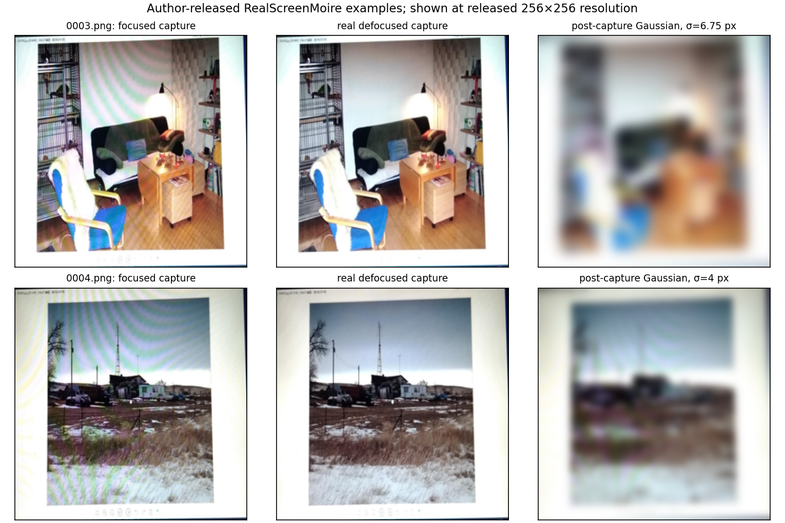

# 真实对焦干预与拍屏薄透镜前向分支

## 这轮回答什么

我们需要让 simulation 的参数先作用在**光学成像、传感器采样之前**，而不是在最终 JPEG 上叠纹理或模糊。这轮找到可核验的真实对焦干预配对，用它检验一个具体错误假设：“把已经拍到的有莫尔纹图像做 Gaussian 模糊，就能代替镜头失焦”。同时把焦距、光圈、屏幕距离和对焦距离接入已有拍屏前向链。**这不是完整设备标定，也没有获得可用于来源分类训练的新增 AI/真实配对。**

## 一、数据究竟是什么

[Liu 等，NeurIPS 2020](https://proceedings.neurips.cc/paper_files/paper/2020/file/fd348179ec677c5560d4cd9c3ffb6cd9-Paper.pdf)报告 RealScreenMoire 有 **50 组**同场景真实对焦／失焦拍屏配对；作者用 OPPO R9、HONOR 9、HUAWEI P30 Pro，并在不同配对间改变距离和角度。对焦切换时遥控拍摄，之后裁出屏幕区域并用单应性配准。论文另有基于数字图生成的 SynScreenMoire，不能混称真实采集。

本轮从[作者仓库](https://github.com/baolp/demoireing_with_focused_and_defocused_images_pairs)固定提交 `e38f093f525738fd13a9fab956db10e94830907e` 实际取得的是 **5 组公开示例**，不是论文全部 50 组。`moireresize`、`blurresize` 各 5 张 PNG；10 文件均核验 Git blob SHA1、下载 SHA256、完整解码和 256×256 尺寸。低通内容相关性在 5×5 两两配对中全部把同名图选为最接近，真配对相关系数为 0.99908–0.99983，异名最大约 0.428。核验记录：`work/fdnet_real_screen_pairs_audit.json`、`work/fdnet_focus_pair_process_probe.json`；图像位于 `E:\ai_image_origin_research\data\raw\fdnet_real_screen_pairs`。

这些是**已裁切配准的发布图**，无逐张设备、镜头焦距、光圈、焦点距离、原生 RAW，也无屏幕显示的原始数字图。它们能检查对焦干预的可见结果，不能唯一反推出镜头 PSF 或屏幕像素结构。

## 二、真实配对如何反驳“成片后模糊”

在看过图像后，固定两组可辨平坦条纹区（`0003` 白墙、`0004` 天空），在各自区域选强频谱峰。令后期 Gaussian 的 σ 从 0 到 12 px 搜索，仅匹配**该峰的功率比**，再在另一内容区域检验梯度细节。数值来自 `python -m experiments.screen_numerics.evaluate_fdnet_focus_pairs`；这个有选择性的探索实验不能当全数据显著性结论。

| 发布配对 | 选定条纹频率，周期/像素 | 真实失焦／对焦的峰功率比 | 后期 Gaussian 匹配 σ | 对焦内容梯度 | 真实失焦内容梯度 | 后期模糊内容梯度 |
|---|---:|---:|---:|---:|---:|---:|
| `0003` | 0.06625 | 0.000707 | 6.75 px | 0.04409 | 0.04269 | 0.01355 |
| `0004` | 0.08570 | 0.01121 | 4.00 px | 0.04074 | 0.03964 | 0.01316 |



视觉上真实失焦图抑制了大量彩色条纹，主体仍可辨；为压低所选峰而做的后期模糊丢失更多主体边缘。后期图**只匹配了一个峰**，仍可能留下别的条纹；不能把它称为完整拟合的反例。颜色变化、配准、降采样和 ISP 也可能参与真实差异，所以这两组不能单独归因于镜头失焦。

## 三、为什么顺序产生这个差别

在显示格点被相机采样后，高频格点可能折叠到低频，成为莫尔纹。对已折叠的低频施加后期低通，会一并损失本来处在附近频率的内容。若光学模糊先削弱高频格点，再由传感器积分／采样，混叠就可能不产生，主体低频细节可保留。虚拟解析积分反例：显示格点的折叠频率 0.07 周期／传感器像素，内容 0.15；传感器前 σ=0.55 px 时，格点幅度 0.003061→0.0000175，而内容 0.05489→0.04916。把格点幅度压到相近的成片后 σ=7.25 px，内容只剩 0.00000115。参数纯为**机制演示**，不对应公开手机的实测 PSF；复算 `python -m experiments.screen_numerics.probe_focus_before_vs_after_sampling`。

## 四、已经接入的物理参数与适用域

`origin_simulation/screen_capture.py` 的新分支用薄透镜近轴公式。设焦距 $f$、屏幕物距 $u_s$、焦点物距 $u_f$、光圈 f 数 $N$，像距为 $v(u)=fu/(u-f)$，孔径直径 $D=f/N$；在位于 $v(u_f)$ 的传感器平面，几何弥散圆的**半径**为

$$r_{\rm CoC}=\frac{D\,|v(u_f)-v(u_s)|}{2v(u_s)p},$$

其中 $p$ 是传感器像素间距。与 [MIT《Foundations of Computer Vision》镜头／景深章节](https://visionbook.mit.edu/lenses.html)的薄透镜和弥散圆几何一致。`thin_lens_frontoparallel_sensor_to_display` 用 $v(u_f)$ 同时更新正对屏幕的像素尺度，表示调焦造成的轻微视场变化。

实现把显示驱动值转为发光辐亮度后，依次做已有的理想 Airy 截止、近似均匀几何弥散圆、可选残余光学 Gaussian，再积分传感器像素、采 Bayer RAW、运行简化 ISP；因此光圈同时影响理想衍射和几何失焦。圆盘用细网格 4×4 分数面积核，带 halo 分块卷积。需要传入完整的焦距／光圈／屏幕距离／对焦距离／像素间距。当前只接受单距离、仿射显示平面和 `spatial_method="fine"`；透视平面的距离梯度、复杂光阑、波动光学失焦、真实镜头像差、镜头呼吸的内部光学机制、通光量随光圈变化均未建模。圆盘与 Airy 顺次卷积是可检查的**近似**，不是精确离焦衍射 PSF。高速 `analytic`／`prefilter` 分支目前不支持它。

数值例子：$f=4$ mm、$N=2$、屏幕 0.5 m、焦点 1 m、像素 4 μm 时，弥散圆半径约 **1.004 px**；焦点回到屏幕为 0，收光圈至 $N=4$ 时半径减半。这些是指定参数的推导，不是 FDNet 设备估计。

又以**虚拟的** 0.533 mm 显示像素间距，做完整的显示格点→衍射／失焦→像素积分前向试验。焦点由 0.5 m 改到 1.0 m，正对投影尺度由 0.93058 变为 0.93433 显示格／传感器像素；格点折叠幅度从 0.002147 降到 0.000209（约 9.7%）。扣掉同条件平场输出后，0.15 周期／像素的内容增量幅度从 0.05518 降到 0.04916（约 89.1%）。这确认本分支能按同一组物理参数联动**视场变化、弥散圆、格点混叠和内容保留**；显示间距是为了构造压力条件而选，绝非 FDNet 屏幕参数。复算 `python -m experiments.screen_numerics.probe_physical_focus_display_lattice`，逐项数值在 `work/screen_thin_lens_focus_lattice_probe.json`。

## 五、复算与下一步门槛

```powershell
python -m experiments.screen_numerics.audit_fdnet_real_screen_pairs
python -m experiments.screen_numerics.evaluate_fdnet_focus_pairs
python -m experiments.screen_numerics.probe_focus_before_vs_after_sampling
python -m experiments.screen_numerics.probe_physical_focus_display_lattice
python -m experiments.screen_numerics.plot_fdnet_focus_comparison
python -m pytest -q tests/test_screen_thin_lens_defocus.py tests/test_screen_focus_intervention.py tests/test_screen_prefilter.py tests/test_screen_capture.py
```

本轮相关测试 **21 通过**，包括薄透镜半径、光圈依赖、正对投影的焦点尺度、平场能量、格点抑制、分块 halo 一致性、恰好对焦时与原 Airy 分支相等，以及非适用路径拒绝。另外拍屏透视、发布链等相关集在增加最后一项测试前运行 **42 通过**。这些证明实现按指定方程运作；**不证明真实手机参数已识别**。

下一步应优先寻找同一设备的数字显示输入、原生 RAW、焦点／光圈／距离记录一起提供的数据；至少需要其中几个量的受控干预。现有 5 组可作为焦点干预的外部定性／部分频谱约束，不能拿来拟合全链后声称模型预测了未观测条件。来源判别训练仍应等待跨设备的真实传播验证；RR 同包留出不替代这一步。
