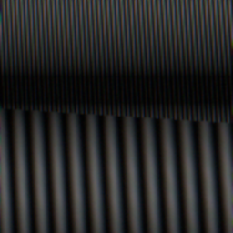

# 拍屏 simulation 第二阶段：透视、行曝光与可运行输出

**2026-09-25 校正：**本报告原有 PWM 行增益表使用旧版“按平均占空比归一化”的定义；固定峰值亮度下的光子积分已更正，详见[时间链语义校正](拍屏PWM光子积分语义校正_2026-09-25.md)。原表仅作历史实验记录。

**2026-09-25 扩展：**后期 ISP 亮度锐化已作为默认关闭的结构假设加入，详见[新分支与真实配对反证](拍屏ISP亮度锐化分支与Chimera反证_2026-09-25.md)。本报告以下表述的是添加前的版本。

2026-09-24。**状态：可运行的物理结构模拟器，尚未经真实设备参数标定或受控实拍验证。**这一步实现了从指定 RGB 显示帧到模拟相机 JPEG 前图像和 RAW 中间量的完整可执行路径；生成的条纹、颜色或分类分数均不能据此宣称与某台真实设备一致。

## 已实现的链

`显示帧 RGB → 简化 gamma/竖直 RGB 发光子像素 → 透视投影 → 光学高斯低通 → 传感器像素面积积分 → 可选屏幕 PWM × 逐行曝光积分 → RGGB 取样 → Poisson/读噪 → 双线性去马赛克与 sRGB 曲线`。

源代码 `origin_simulation/screen_capture.py`。正对、轴对齐时继续用原有矩形发光单元的面积积分；斜拍或旋转时用传感器细网格上的投影采样与收敛检查。`sensor_to_display` 是**从传感器连续坐标到屏幕数字像素坐标**的单应矩阵。光学低通施加在像素积分**之前**，以免先采样产生的混叠被事后模糊伪装成真实抗混叠。可选的时间链假设全屏同步方波调光：逐行起始时间加曝光时长，精确计算每一行覆盖的发光占空比例；曝光覆盖整周期时行增益趋于一致。新增按秒计的光电子率，使曝光时长同时影响平均信号与光子噪声；旧的“每单位辐照度已积分电子数”参数保留作历史复算，二者不可同时启用。这是可证伪的简化模型，**不代表所有屏幕都有 PWM 或同一种扫描方式**。

大图现按传感器块渲染，光学模糊在块边保留核半径外的光晕再裁回，避免接缝。对较大的细网格使用反射边界 FFT Gaussian 卷积；小网格沿用直接卷积。程序保留 `irradiance`、`row_exposure_gain`、`noiseless_mosaic`、`raw_mosaic`、`srgb`，可分别与未来 RAW/JPEG 实测比较。单图 CLI 为 `origin_simulation/render_cli.py`；输入图、参数 JSON、输出 PNG/NPZ 都有 SHA-256 和耗时记录。

## 数值与运行检查

| 检查 | 结果 | 解释范围 |
|---|---|---|
| 透视投影下白屏发光积分，32 与 48 细采样/传感器像素 | 最大辐照度差 <0.025；整体均值接近填充面积解析值 | 仅数值收敛，不是物理标定。 |
| PWM 100 Hz、25% 占空比 | 2 ms 短曝光和 2 ms 行间隔得周期性行增益 `[4,1,0,0,0,…]`；10 ms 整周期曝光各行增益为 1 | 验证方波与滚动积分数学实现。 |
| 固定光电子率，曝光 10→20 ms | 在各自行覆盖完整 PWM 周期时，平均未饱和 RAW 信号变为两倍 | 验证快门长度与光子数联动；设备实际电子率待测。 |
| 同一透视/正对画面的带光学模糊整块和分块计算 | 辐照度最大差 <2×10⁻⁵ | 验证大图分块边界；RAW 浮点中间量容许相同量级舍入差。 |
| 480×480 细网格的 FFT 与直接反射边界高斯低通 | 最大绝对差 <2×10⁻⁶ | 验证快速卷积的数值等价。 |
| 256×256 传感器图、16 倍细采样、透视与模糊 | 本机成功输出，约 2.49 秒 | 证明越过首版 12,000,000 细单元限制；不同设置不能直接比速度。 |
| 256×256、24 倍细采样、同一输入和虚拟参数 | 首版卷积约 11.88 秒；FFT 与预计算后约 6.35 秒；色卡 8 位 PNG 的 SHA-256 相同 | 单次本机开发测量，不是系统化性能基准；当前仍远非大规模训练所需速度。 |

上表的虚拟彩色/条纹例子配置见项目 `docs/virtual_screen_example.json`，其 `parameter_status` 明确为 `virtual, uncalibrated example`。下图是该配置对**自制频率图案**的输出：可见条带和格点结构只是模型假设的后果，不能当作“真实拍屏应有此形态”的证据。



可复算入口（项目根目录）：

```powershell
uv run python -m origin_simulation.render_cli --input E:\ai_image_origin_research\data\derived\controlled_screen_capture\kit_1920x1080_v2\frames\frequency_x_high.png --config docs\virtual_screen_example.json --output-prefix E:\ai_image_origin_research\data\derived\controlled_screen_capture\virtual_frequency_recheck
uv run --extra analysis --extra dev pytest -q
```

## 还缺什么才算过程模拟完成

1. **真实设备标定与外推。** 现有竖直 RGB 子像素、填充率、颜色曲线、Gaussian PSF、RGGB、PWM 及基础 ISP 都是可替换假设。需用已经准备的[首轮受控拍屏流程](../../../docs/controlled_screen_capture_runbook.md)取得真实显示帧、屏幕四角、距离/视角/对焦/曝光、原生 JPEG 与可用 RAW，在未参与参数拟合的距离、角度、图案和设备上比较几何、频谱、边缘、颜色、噪声与条带。
2. **其他物理传播路径。** 此实现只覆盖拍屏空间与简化时间链；打印扫描、拍打印件、拍投影、平台传播和 JPEG 仍是独立过程。RRDataset 再数字化包缺逐张物理方式标签，不能把合并结果当作本拍屏模拟器的真实设备验证。
3. **速度与下游有效性。** 这版 CPU 渲染是科学原型；需在标定后做更高效的积分/批量实现，并分别评估模拟真实性、固定检测器迁移、自研判别算法/模型的真实传播准确率跌幅与含解码延迟。不能因为模型对合成图成绩好就认为真实传播稳健。

[Dragotti 相机级设置核查](../02_拍屏实测/Dragotti公开采集参数与物理约束_2026-09-24.md)提供了固定真实拍屏装置的标称距离和光圈，但 f/11/f/13 还存在原文矛盾，而且公开配对没有逐张实际显示帧、曝光和 RAW；它可供外部成品/几何对照，不能代替上述受控干预。当前已初始化的 `E:\ai_image_origin_research\data\raw\screen_capture_sessions\pilot_001\` 仍为空，未产生物理真实性评价。

## 几何标定到渲染的坐标闭环

新增 `origin_simulation/geometry_bridge.py`，把棋盘测量给出的“数字显示图案边界 → OpenCV 相机像素中心”单应矩阵求逆，接上选定的相机裁切，形成渲染器所需的“连续传感器坐标 → 显示图案边界”映射。首个相机像素中心在渲染坐标 `(0.5, 0.5)`，因此显式处理半像素偏移。开发期构造的非正对单应性中，三个裁切位置的正反投影回到相机像素中心，误差小于 `1e-10` 像素；边界外裁切被拒绝。命令与真实照片接入步骤见[采集操作单](../../../docs/controlled_screen_capture_runbook.md)。

这一步只使**已测数字刺激二维几何**可传入前向渲染；它不推断真实距离、面板物理像素尺寸、镜头畸变、PSF 或曝光。若系统/显示器对刺激做了缩放，数字图案像素不等于物理子像素周期，模拟器的格点/莫尔纹预测便不能按当前坐标解释。必须先确认图案按面板原生像素 1:1 显示。桥接配置为实测投影重新计算过采样下限，并把其余外观参数继续标为虚拟；保留测量 JSON、原始相机文件哈希和裁切坐标。当前没有真实棋盘照片，坐标闭环的验证仍是合成预检。

**新颖性边界：**棋盘求单应性、透视预变形及过采样屏幕图案已有公开先例，例如 [MoiréLens 的 AutoMoiré 模块](https://raw.githubusercontent.com/Ambient-Intelligence-Lab-UMich-EECS/MoireLens-Code/main/automoire/README.md)明确实现这些步骤并以真实相机反馈搜索目标莫尔纹尺度。此处几何桥是本项目的可复算基础设施，不能单独宣称方法创新；后续贡献须建立在**跨显示/相机条件的过程标定、可证伪外推和来源判别收益**的独立证据上。MoiréLens 的任务是用主动设计的正弦格制造稳定莫尔纹，不能把其效果直接当作自然图传播 simulator 的验证。

## 尺度变化的物理不变量预检

对均匀白色数字图，屏幕子像素格仍有周期。令 `a` 为单个传感器像素跨越的显示像素数，一维格点在传感器取样前的基频是 `a` cycles/传感器像素；取样后应出现 `|a-round(a)|` 的折叠频率。保持输入、屏幕布局、传感器不变，仅修改投影尺度 `a`，在模拟图的绿色辐照度通道上测到：`a=0.65 → 0.3516`（预测 `0.35`），`a=0.85 → 0.1484`（预测 `0.15`），`a=1.15 → 0.1484`（预测 `0.15`），频率分辨率为 `1/128` cycles/像素。这个现象是模型空间采样次序的可证伪内部检查，并已加入测试。真实设备可能因镜头低通、不同子像素布局与 ISP 显著压低或改变峰值；**内部符合采样定理不等于真实设备标定通过**。

再固定 `a=0.85`，仅增大**取样前**光学模糊标准差到 `0/0.5/1.0` 传感器像素，中央 128 像素的折叠频率幅度依次约为 `4.71/0.133/0.00012`（同一未归一化 FFT 口径）。真实屏摄可以因为离焦或镜头低通而几乎不见该峰；模拟器不会给每张图硬贴莫尔纹。频谱测量排除了模拟裁切边缘，以免反射边界的能量污染结果。该趋势也是内部因果检查，不提供真实 PSF 数值。

## 本机显示坐标的只读预检

Windows 当前报告主屏 `DISPLAY6` 为 `1920×1080`；`Win32_DesktopMonitor` 中与该分辨率对应的活动 Dell 显示器，其 EDID 首个详细时序也是 `1920×1080`。另一活动 BOE 面板的 EDID 首个详细时序为 `2560×1600`，窗口系统将它报告为 `1280×800` 的另一屏。系统逻辑 DPI 为 96。**据此推断**，先前为主屏生成的 `1920×1080` 校准图案与 Dell 标称时序相符；不能由这些系统报告直接证明 Tk 图案、显卡输出及面板物理像素之间始终为逐像素 1:1，也没有测到物理子像素排列。正式实拍前仍需运行操作单中的 OS 合成截图逐像素核对，并记录实际显示器、HDR/缩放与亮度设置。
