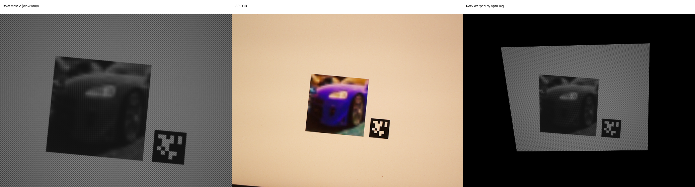
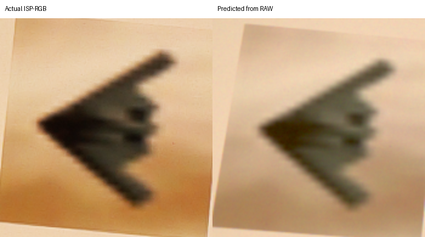
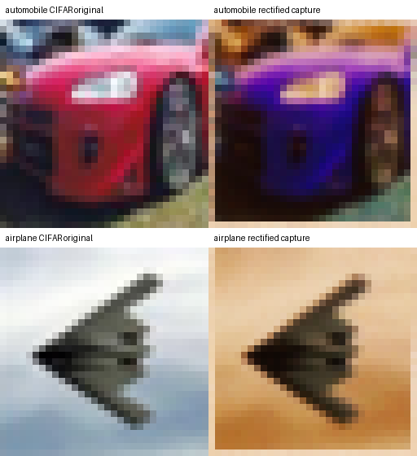

# Raw2Event：真实拍屏 RAW／ISP-RGB 配对的实包审计

**日期：**2026-09-25。**结论范围：**官方数据集中的两个不同类别完整录制前缀；不是全库审计、设备标定或来源判别评测。

## 这批数据能补哪一段证据

[Raw2Event 官方数据卡](https://huggingface.co/datasets/raw2event/raw2event/blob/d400d349292a6ae1c8ea967e9ae99624d8b156cd/README.md)说明，CIFAR-10 图像显示在屏幕上，由 Raspberry Pi Camera Module 3 同时记录 Bayer RAW 与经 ISP 的 RGB 视频，另有事件相机和元数据。官方描述为 59,454 个通过跨模态质检的录制前缀，轨迹为固定圆周运动。它提供 **真实屏幕→光学/传感器→ISP** 的观测机会，但刺激是 CIFAR-10 小图，不是本课题的“自然摄影／AI 生成”整图分类；已审样本中没有可直接使用的逐帧数字显示缓冲区。

本次下载两个前缀的 RAW MKV、RGB MKV 与 DAT，均放在 E 盘 `data/raw/raw2event_probe/`。获取脚本 `work/fetch_raw2event_pair.py` 分别生成 `work/raw2event_probe_download_audit.json` 和 `work/raw2event_probe_airplane_download_audit.json`。

| 前缀 | RAW MKV | RGB MKV | DAT |
|---|---:|---:|---:|
| `10000_automobile_5_1087_20251224_105416` | 96,702,984 B | 88,072,864 B | 12,046 B |
| `1000_airplane_1_9934_20251222_161953` | 98,562,806 B | 89,255,637 B | 12,046 B |

四条视频均通过官方 LFS SHA256 验证；两个 DAT 均通过官方 Git blob SHA1 验证。第一条录制的 RAW/RGB SHA256 分别为 `eb361455828467792a477962ce872f813c1e59b7b121069565eaffaaca4ed863` / `aa952db05ff7daa6343bdf58fa21e5171de250d53596f5e5829476f25d60556a`；第二条分别为 `eac4aac35b8188a874d104a189fd579de5cfd7e45da1595f3e66b8eed0a53f85` / `3421440677ec4c094234de25aa17160fedfa0a59154670f0af624bbac2ed34dc`。全部指纹见两份下载审计。

## 视频、RAW 位深与配准

`ffprobe` 和实际抽帧确认两个前缀的 RAW/RGB 都是 FFV1 无损编码、**692×520、317 帧**，各前缀内两条流的容器 PTS 均为 **317/317 完全相同**，首尾为 0.000 与 5.267 s。RAW 解码为 `gray16le` 容器；每条录制的五个抽样帧都在 10 位范围，按位 OR 为 1023。这支持数据卡的“10-bit Bayer”说明，不能把 16 位容器误称 16 位有效信号。样本内四种奇偶行列位置的均值有稳定差异，两个位置均值接近；这与 Bayer 周期相容，但具体 CFA 相位仍需颜色标靶或稳定配准后验证。

[官方 Croissant 元数据](https://huggingface.co/datasets/raw2event/raw2event/blob/main/croissant.json)称 Pi 录制为 **50 fps**、自动曝光/增益关闭、自动对焦开启；本次两个已验 MKV 的 PTS 和 317 帧／5.267 s 则约为 **60 fps**。因此这里把可复算的容器时间轴作为分析依据，不把数据页 50 fps 直接代入模拟时间参数。AE/AGC 与对焦状态只是作者元数据声明，尚无逐帧实测记录佐证。

**同帧时间戳不等于同像素坐标。**同一图像中的 AprilTag 36h11、ID 0 在 RAW 和 RGB 上都能检出。五个抽样时刻，Tag 在 RAW 图上的平均边长约为 RGB 的 **1.707–1.737 倍**。以第 0 帧为例，RAW Tag 中心约 `(505, 401)`，RGB 中心约 `(441, 344)`；直接按 `(x,y)` 比较 RAW 与 RGB 会把不同物理位置错配。对每帧分别用 Tag 四角求平面单应矩阵并用公共有效区域评估，7×7 Gaussian 轻度平滑后的亮度 Pearson 由未配准的 **0.370/0.402/0.439/0.400/0.403** 变为 **0.959/0.839/0.843/0.921/0.753**（帧 0/80/160/240/316）。这表明 Tag 配准有实效，也表明不同姿态/运动和 Bayer、ISP 差异仍留下残差；这个 Pearson **不是**模拟保真度或 ISP 校准精度。

第二条 airplane 录制复现了相同结构：五帧 Tag 边长比 **1.708–1.727**，相同亮度对照由未配准的 **0.395–0.430** 升到逐帧 Tag 配准的 **0.816–0.930**。为检验变换是否只是每帧自由拟合，用每条录制**第 0 帧**的 Tag 单应矩阵预测另外四个抽样帧的 RGB Tag 四角，平均误差 automobile 为 **0.82–2.21 像素**、airplane 为 **0.92–2.35 像素**。这支持两条录制中相对稳定的 RAW→RGB 几何关系；五帧抽样仍不足以保证所有录制都固定。



## 元数据声明与实包可见字段

官方数据卡把 `meta_raw/<P>.dat` 描述为含时间戳、传感器序列号、曝光、增益、同步偏移。**两个**实包均为 **12,046 = 317×38** 字节；逐条观察到前 8 字节可按小端 `float64` 读出递增数值（帧间增量中位 16,650），随后 26 字节为可解析的日历时间文本，再随后 4 字节在每条录制的 317 条中全为零。记录数均恰好等于视频帧数。

**在这两个文件内，未识别出可独立验证的曝光、增益或传感器序列号字段。**38 字节结构仅为本次实包的经验拆解，不是作者公开的正式二进制规范；不能据此断言全库或其他元数据包都没有这些字段，也不能把零值尾缀猜作具体物理量。相机曝光/增益目前仍是待证据约束的参数。

## 最小 ISP 映射的跨内容压力测试

为检验“RAW→ISP-RGB 可先用简单相机链近似”这一假设，固定两条录制的首帧及各自 Tag 几何：把 Bayer RAW 双线性去马赛克、轻度模糊并投到 RGB 坐标；仅在 automobile 首帧拟合一个带偏置的 3×3 颜色矩阵，分别试直接映射到编码 RGB 和先映射到线性光再施加标准 sRGB 曲线。四种 Bayer 代码枚举但**只按 automobile 显示内容块误差选择**；airplane 首帧完全留出。内容块是预先固定的 RGB 坐标 `x=225:400,y=185:365`，外部黑区不计入误差。

| 假设 | Automobile 内容块 MAE / 255 | Airplane 内容块 MAE / 255 | Airplane 全有效区 MAE / 255 |
|---|---:|---:|---:|
| 编码 RGB 上的 3×3＋偏置 | 21.94 | 21.58 | 12.32 |
| 线性光 3×3＋偏置，再转 sRGB | **21.02** | **20.93** | **9.41** |



线性光形式跨内容略好，但内容块仍有约 **21/255** 的平均通道绝对误差；大面积浅色背景使全有效区指标显得更好，不能拿它掩盖图像内容误差。残差混合了 Tag 角点/平面插值误差、真实 ISP 的白平衡/色调/降噪/锐化，以及未测的相机设置；**无法从这两个视频中独立归因**。这项检验仅说明低维映射可以迁移部分颜色，不是实际 ISP 的辨识结果。

更重要的是一个严格的**不可辨识性**：若允许自由的 3×3 颜色矩阵，互换 RAW 去马赛克的红蓝通道，可由矩阵反向交换而获得完全相同的预测。实测 `RG` 对 `BG`、`GR` 对 `GB` 的 airplane 内容块 MAE 最大差仅约 $1.1\times10^{-12}$/255。故前文的 Bayer 周期观察不能被这项拟合“确认相位”；需要独立色块/设备说明或受约束的光谱响应。复算结果在 `work/raw2event_isp_transfer.json`，代码为 `work/probe_raw2event_isp_transfer.py`。

## 已从官方 CIFAR-10 包找回这两张数字源

接着下载 [CIFAR-10 官方发布格式](https://www.cs.toronto.edu/~kriz/cifar.html) 的 Python 档案；实际字节由 Hugging Face 镜像取得，**170,498,071 B**，MD5 `c58f30108f718f92721af3b95e74349a` 与多伦多大学官网完全一致。只在内存中读取六个批次，不解包到工作区。对两段首帧人工框出显示小图、透视矫正到 32×32，然后在各自 **6,000 张同类候选**中用灰度去均值归一化相关排序：

| 录制前缀 | 匹配到的原始数字图 | Top-1 相关 | Top-2 相关 | 前缀索引核验 |
|---|---|---:|---:|---|
| `10000_automobile_5_1087_...` | `data_batch_5` 第 1087 行 | **0.7325** | 0.6524 | `_5_1087_` 一致 |
| `1000_airplane_1_9934_...` | `data_batch_1` 第 9934 行 | **0.9420** | 0.8261 | `_1_9934_` 一致 |



两组图的形状和具体内容肉眼也一致；尤其 automobile 原图偏红、拍屏图偏紫，说明颜色并非无损复制。检索排序、前缀中批次/行号一致和视觉一致共同支持**这两个样本的原始数字图身份**。但屏幕实际输入缓冲区的插值、色彩管理、背景和 Tag 布局未发布；人工四角也只是内容检索手段，不能反推设备的物理几何。**这现在提供了两个“原数字图→真实拍屏 RAW/RGB”的锚点，尚不是完整已标定的显示与相机过程。**数字源像素 SHA256 及全部前十候选记录在 `work/raw2event_cifar_source_match.json`。

## 对过程 simulation 的具体作用和限制

| 可做 | 尚不能做 |
|---|---|
| 在真实同帧数据上核对 RAW 数值范围、CFA 周期、运动时序和 RAW→ISP-RGB 的条件映射；用 Tag 先做显示平面配准。两例还能锚定官方原始数字小图。 | 直接按相同像素索引拟合 RAW→RGB；把画面的几何差当镜头变焦或真实显示尺寸。 |
| 把同一设备的部分录制前缀分为校准／整段留出，评估模拟 RAW/ISP 噪声、色彩和局部结构。 | 用这一条录制推断所有手机相机、不同屏幕或距离×角度×曝光干预网格。 |
| 形成“数字源→屏幕→RAW→ISP”两例配对的入口，供 Chimera 拍屏反证后定位缺失环节。 | 用 CIFAR-10 类别声称 AI／自然摄影判别能力，或从这批 RAW 直接解释 Chimera 的 B-Free 分数下降。 |

**下一实验入口：**两张数字源已识别，可分别在 automobile 设参、airplane 留出，检验“数字源→显示放大/发光→镜头→RAW”的几何、亮度与频率变化；仍须把未知的屏幕插值和色彩管理作为条件假设，而非真实设备参数。用独立色块或设备规格约束 CFA/有效色彩响应，再扩大到多前缀、不同内容和运动状态；估计黑电平、噪声—信号关系及局部 ISP 残差。只有找到真实**显示帧**及可靠物理设置记录，才能把两例扩成完整已标定设备链。Chimera 的 840 个 reserved 来源继续不用于参数挑选。

## 复算

```powershell
python work/fetch_raw2event_pair.py
python work/audit_raw2event_probe.py
python work/fetch_raw2event_pair.py --prefix 1000_airplane_1_9934_20251222_161953 --audit work/raw2event_probe_airplane_download_audit.json
python work/audit_raw2event_probe.py --prefix 1000_airplane_1_9934_20251222_161953 --out-dir work/raw2event_probe_airplane --report work/raw2event_probe_airplane_pixel_audit.json
python -m work.probe_raw2event_isp_transfer
python work/fetch_cifar10_python.py
python -m work.match_raw2event_cifar_source
```

抽帧、PTS、Tag 角点、亮度对照和经验元数据结构记录在 `work/raw2event_probe_pixel_audit.json` 与 `work/raw2event_probe_airplane_pixel_audit.json`；示意图源帧位于各自的 `work/raw2event_probe*/`。CIFAR 档案验收在 `work/cifar10_python_download_audit.json`。脚本不执行来源检测器推理。
