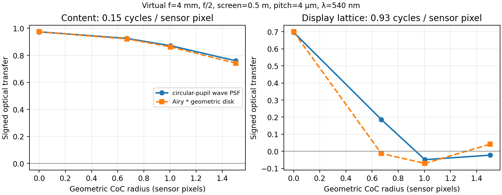

# 拍屏失焦：圆形瞳孔波动光学参照与旧圆盘近似的误差

## 为什么补这一步

上一阶段把对焦距离接入拍屏模拟，但光学部分是“在焦 Airy 强度核 ∗ 均匀几何弥散圆”。这保留采样前失焦的因果位置，却未计算离焦时**同一瞳孔内不同位置的光场相位**。在可能出现显示格点混叠的频率上，两个模型是否相近必须检查，不能用结构测试通过代替。此处的[瞳孔函数→点扩散函数](https://www.nature.com/articles/s41598-021-82965-z)和[离焦衍射积分](https://www.jeos.org/index_php/jeos_rp/article/view/13044/0)来自原始光学研究；我们实现的是低 NA、圆形均匀瞳孔、单一平面距离的标量近轴版本。

## 模型及可复算数值

设屏幕物距 $u_s$、对焦物距 $u_f$、焦距 $f$、孔径半径 $a=f/(2N)$、波长 $\lambda$。薄透镜像距 $v(u)=fu/(u-f)$。在传感器像面半径 $r$ 处，使用归一化径向瞳孔坐标 $\rho$：

$$A(r)=2\int_0^1\rho\exp\!\left[i\pi\frac{a^2}{\lambda}\left(\frac{1}{v(u_f)}-\frac{1}{v(u_s)}\right)\rho^2\right]J_0\!\left(\frac{2\pi ar\rho}{\lambda v(u_f)}\right)\,d\rho,\qquad PSF(r)\propto|A(r)|^2.$$

对不同颜色的有效单色波长分别积分，再将**强度**核卷积到显示辐亮度上；其后才做传感器像素面积积分、Bayer/RAW、ISP 与发布编码。这里假设各发光点互不相干。`origin_simulation/optical_psf.py` 用 Gauss–Legendre 节点算径向积分，核截取在几何弥散圆半径再外加约 6 个在焦 Airy 首零半径，最后归一化。`origin_simulation/screen_capture.py` 中可显式设置 `defocus_psf_model="wave"`，旧 `geometric_airy` 仍保留为可复算对照；只有 `spatial_method="fine"` 支持它。

虚拟设置统一为 $f=4$ mm、$N=2$、屏幕 0.5 m、传感器像素 4 μm、绿光 540 nm；改变对焦距离。下表的“传递”是**带符号**的光学频率响应，负值表示纹理相位翻转。总变差距离衡量两个已归一化二维 PSF 的差异；它不是与真机的误差。

| 对焦距离 | 几何弥散圆半径 | 两 PSF 总变差距离 | 波动／旧近似：0.15 周期/像素 | 波动／旧近似：0.93 周期/像素 |
|---:|---:|---:|---:|---:|
| 0.50 m | 0 px | 0.012 | 0.974 / 0.974 | 0.697 / 0.700 |
| 0.75 m | 0.670 px | 0.234 | 0.925 / 0.921 | **0.186 / −0.012** |
| 1.00 m | 1.004 px | 0.233 | 0.871 / 0.863 | −0.049 / −0.071 |
| 2.00 m | 1.503 px | 0.224 | 0.760 / 0.742 | −0.023 / 0.042 |



在 0.75 m 的关键例子，积分 96→160 节点令 0.93 周期/像素的值变化小于 $10^{-10}$；核边界从“几何半径+6 个 Airy 半径”加至 +9 后，0.18636→0.18545。故该频率上的差别并非主要由积分精度或此项截断选择造成。低频 0.15 的值随这项核范围从 0.9253→0.9183，说明有限支持仍影响较小频率差，不能将表格小数解释成绝对物理精度。完整记录：`work/wave_optical_defocus_psf_probe.json`，复算 `python -m work.probe_wave_optical_defocus_psf`。

## 接入完整链后的影响

用上一阶段**虚拟**正对屏幕、0.533 mm 显示像素间距、0.15 周期/像素的输入内容，固定其余参数，只切换失焦核。对焦 0.5→1.0 m 时：

| 光学核 | 条纹混叠幅度：对焦→失焦 | 失焦/对焦 | 扣平场后的内容幅度比 |
|---|---:|---:|---:|
| Airy ∗ 几何圆盘 | 0.002147→0.000209 | 9.73% | 89.08% |
| 波动光学瞳孔 | 0.002104→0.000146 | 6.94% | 89.35% |

这表明两种核在一个指定采样相位下，对**条纹残留**的预测已有可见差别，尽管内容的单频保留接近。此虚拟格距只是压力测试，不能解释成 FDNet、Chimera 或 RR 的实测屏幕参数。复算 `python -m work.probe_physical_focus_display_lattice`，结果 `work/screen_thin_lens_focus_lattice_probe.json`。

## 验证与边界

```powershell
python -m work.probe_wave_optical_defocus_psf
python -m work.probe_physical_focus_display_lattice
python work/plot_wave_optical_defocus.py
python -m pytest -q tests/test_screen_wave_defocus.py tests/test_screen_thin_lens_defocus.py tests/test_screen_focus_intervention.py tests/test_screen_prefilter.py tests/test_screen_capture.py tests/test_screen_capture_projective.py tests/test_screen_pipeline.py tests/test_publication.py
```

相关 **46 项测试通过**，其中新增测试核验精确对焦时数值积分收敛到圆孔 Airy 公式、离焦核归一化／对称、必要参数拒绝和分块渲染一致。相机真实镜头像差、非圆光阑、传感器微透镜、显示原色光谱、视场相关 PSF、光圈改变时的曝光，以及不同距离的透视屏幕仍未验证或建模。选择 `wave` 只提高**指定理想光学假设**下的过程一致性，不能据此声称已复现任何真实手机；下一步要用真实 RAW、数字显示源和受控焦点／光圈数据检验参数迁移。
