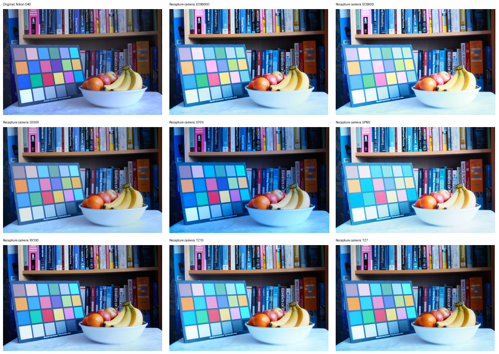

# 真实拍屏跨相机配对：过程约束与可验证边界

2026-09-24。本报告是**真实配对数据的小规模审计和几何检验**，并非完整拍屏模拟器的验证，也不是自然摄影/AI 来源判别实验。大图保存在 E 盘；下方缩略图仅供检查内容与跨相机外观，不能据缩略图判定高频莫尔纹。

## 1. 为什么选这个数据

[Dragotti 课题组官方档案](https://www.commsp.ee.ic.ac.uk/~pld/research/Rewind/Recapture/)发布了原拍与 LCD 再拍图。[论文第 V.C 节](https://www.commsp.ee.ic.ac.uk/~pld/publications/IEEETransactionsINFS_THT_HM_PLD15.pdf)说明：原拍先经双三次缩放，在经 sRGB 校准的 NEC EA232WMI LCD 原生分辨率显示；暗室中固定三脚架，按相机确定拍摄距离与光圈，以尽量抑制**可见**混叠，再拍成品裁去屏幕边框。这与只挑明显莫尔纹图的评测形成重要互补：物理模拟还必须能产生没有强烈可见条纹、但确实经过显示—拍摄链的图。

官方网页把两个 ZIP 合称“完整数据库”，但论文总采集数（1,035 原拍、2,520 再拍）大于 ZIP 目录中的评测划分（900 非重复原拍名称键、1,440 再拍）。本次只用官方 ZIP 的 HTTP Range 抽取少量条目，**没有下载并验完整个 8.44 GB 档案**；详细目录校正见[此前审计第 7–8 节](Simulation受控采集准备与数据可用性审计_2026-09-24.md)。

## 2. 实包核验与几何计算

选同一原拍键 `D40-015`：源 JPG 为 3008×2000、SHA-256 `c6b389d3486ee469b9eb6879837287f5e996b32060f5018c786cb27b591ae41b`；八台再拍相机各有一张 PNG。逐条通过 ZIP 解压长度与 CRC-32，另存 SHA-256；8/8 张可解码。原拍文件是 Nikon D40 拍自然场景的图，其 EXIF **不是**再拍相机参数。八张 PNG 用 Pillow 查看均只给 `dpi` 键，未取得逐张焦距、距离、光圈、曝光或 RAW。ZIP 名称能标记再拍设备，不能恢复这些实际设置。

对每张再拍 PNG 与源 JPG 在最长边 1200 像素尺度做 SIFT 匹配、0.75 比值筛选和 3 像素 RANSAC 单应性拟合。表中 `内点` 是与拟合几何一致的特征匹配数，`重投影中位数` 是**内点**的像素误差，二者只说明同源内容的几何配准质量；不能视为成像模拟精度。

| 再拍相机 | 发布 PNG 宽×高 | 内点数 | 内点重投影中位数，1200 边像素 | 条件性投影屏幕像素间距 $k^*$ |
|---|---:|---:|---:|---:|
| EOS600D | 2130×1420 | 1,487 | 0.244 | 1.3272 |
| EOS60D | 2002×1326 | 1,419 | 0.228 | 1.2420 |
| D3200 | 2148×1428 | 1,395 | 0.186 | 1.3347 |
| D70S | 2142×1418 | 1,673 | 0.259 | 1.3361 |
| EPM2 | 2260×1500 | 1,360 | 0.231 | 1.3991 |
| RX100 | 2012×1338 | 1,711 | 0.185 | 1.2453 |
| TZ10 | 2286×1522 | 1,464 | 0.215 | 1.4262 |
| TZ7 | 2164×1440 | 1,635 | 0.243 | 1.3475 |

这里的 $k^*$ **是有条件的换算，不是测得的真实屏幕/传感器间距**：设原 JPG 的 2000 行等比例铺满显示内容的 1080 行，且发布 PNG 只被裁切、没有再次缩放；由配准单应性在画面中心的局部竖直缩放 $s$，计算 $k^*=s\,(2000/1080)$。EOS600D 得 1.3272，与论文为控制混叠选择的 $4/3\approx1.3333$ 相差约 0.46%。这是有力的**内部几何一致性检查**，但公开包没有实际显示帧与逐张处理记录，不能据此证明发布图中的每个屏幕像素都恰好投影 1.3272 个传感器像素。各相机的 $k^*$ 不同也不能直接解释为相机硬件效应；作者按相机调整过拍摄设置。

进一步抽取相邻原拍文件 `D40-016`（SHA-256 `62dd652d0ce5ec80145ad148062f84f27aaf51d7b310a2a03f30734bdccf4d89`）与四台再拍相机的对应 PNG；5 个新 ZIP 条目也逐条通过长度、CRC-32 和 SHA-256 检查。该原拍仍是同一书架、色卡、果盘场景的相邻拍摄，**不是独立场景**。同一相机在两张原拍上的换算数值如下；四台相机的最大绝对差仅 0.00033。这支持“这组发布图的几何比例稳定”，但不能验证不同场景、距离或角度下的物理响应。

| 再拍相机 | `D40-015` $k^*$ | `D40-016` $k^*$ | 两次绝对差 |
|---|---:|---:|---:|
| EOS600D | 1.327151 | 1.326954 | 0.000197 |
| EOS60D | 1.241951 | 1.241775 | 0.000176 |
| D3200 | 1.334679 | 1.334416 | 0.000263 |
| TZ10 | 1.426214 | 1.426543 | 0.000329 |

## 3. 对过程模拟的具体约束

1. **先模拟显示帧，再模拟投影。** 原始 JPG 与屏幕实际发光帧之间有查看器缩放/色彩变换。发布档案没有逐像素显示帧，所以此包不能做源 JPG 到再拍 PNG 的严格像素级光学标定。
2. **投影尺度与光学模糊必须耦合。** [原论文](https://www.commsp.ee.ic.ac.uk/~pld/publications/IEEETransactionsINFS_THT_HM_PLD15.pdf)利用投影格点间距调整距离，再用光圈引起的衍射抑制可见混叠；独立随机贴纹理无法表示这个因果关系。
3. **要覆盖弱/无可见莫尔纹。** 此档案刻意拍出高质量、低可见混叠图。[另一项受控屏摄实验](https://yichao0319.github.io/assets/publications/security21_cheng.pdf)也显示条纹随距离/角度变弱甚至不可见。真实拍屏标志不能等价为“强条纹”。
4. **显示器、镜头、传感器与 ISP 的参数不可凭这批 PNG 单独识别。** [CameraVDP 的校准研究](https://arxiv.org/html/2509.08947v2)把几何、MTF、暗角、颜色和噪声分开测量，并使用像素位移摄影/色度测量；它明确不处理普通 Bayer 单次拍摄的去马赛克。当前小样本只能约束联合输出，不能把拟合的颜色或模糊值称作某设备的真实独立参数。

## 4. 下一步可证伪的路线

下一轮应选**真正不同的场景**，检验几何换算是否仍稳定，并在这些配对上分开测残余格点/边缘响应与颜色变化。若同一相机在不同场景下的比例不稳，先查发布缩放、裁切与配准假设，再谈前向模型。此档案没有距离/角度/曝光干预网格，不能拿它替代[受控拍屏协议](../../docs/controlled_screen_capture_protocol.md)；需要 RAW/sRGB 成对数据时还需核实 RawVDemoiré/RDNet 实包可取性。将来加入自然/AI 来源检测器时，应先固定模拟器与数据划分，另在真实再拍图上测试分数迁移。

可复算入口：`work/probe_dragotti_range.py`（HTTP Range、CRC/SHA 抽取）、`work/analyze_dragotti_probe.py`（配准与表格）、[机器可读审计记录](Dragotti跨设备配对审计_2026-09-24.json)；逐图图像字节留在 E 盘 `data/derived/dragotti_probe/`。目前只审计同一场景的 2 个原拍文件、共 12 个再拍条目，不能推断整个档案的统计分布。
