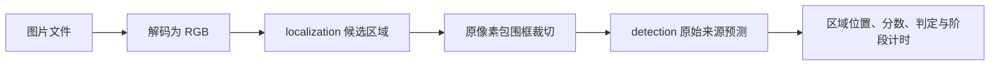
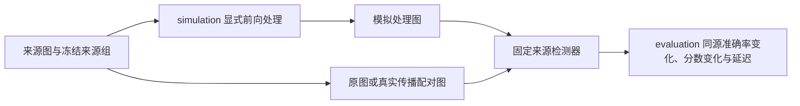

# 源码目录与业务链路

[仓库首页](../README.md) · [详细架构](../docs/architecture.md) · [安装与推理接入](../docs/detection_pipeline.md)

## 研究目标

输入一张经过未知缩放、JPEG 重存、截屏或物理再拍的图像，判断其**原始视觉内容**来自自然摄影还是 AI 生成，并研究传播后的准确率变化与推理速度。AI 图经过拍屏后，其来源标签仍是 AI。

业务包括区域定位、来源判别、处理过程模拟、数据与评测，以及后续自研算法/模型训练。下面分别说明可调用的能力与预留接口。

当前非深度学习算法已有[局部统计原型](palimpsest/detection/algorithms/local_statistics/README.md)，具体流程见[开发计划](../docs/robust_ai_detection_plan.md)。[首轮真实拍屏诊断](../reports/04_算法研发/首轮局部统计算法_开发筛选与真实拍屏诊断_2026-10-05.md)失败，不能视作已经可部署的稳健方法。

## 目录结构

第三轮增加[灰度顺序统计](palimpsest/detection/algorithms/ordinal_statistics/README.md)，仍未通过处理后准确度门槛。`data/source_groups.py`提供可复用的精确文件来源连通组；它不是近重复检测器。

```text
src/
├── README.md
└── palimpsest/                 可安装、可复用的 Python 公共库
    ├── contracts.py           RGB、区域坐标/掩膜、来源预测的共用类型
    ├── localization/          找到需要判别的候选区域
    │   ├── interfaces.py      RegionLocator 定位/分割协议
    │   └── baselines/         四边形提议与 SAM 2 自动分割
    ├── detection/             判别原始自然摄影/AI 内容
    │   ├── interfaces.py      OriginDetector 来源预测协议
    │   ├── algorithms/        自研非深度学习统计原型（稳健性未通过）
    │   ├── models/            自研神经模型（待开发）
    │   ├── baselines/         B-Free、D3、Benford 参考实现适配
    │   └── files.py           单检测器的文件解码与推理计时
    ├── pipelines/             组合区域定位与来源判别
    │   ├── image.py           ImageOriginPipeline 图片业务链
    │   └── cli.py             palimpsest-detect 命令入口
    ├── simulation/            按处理事件组织的前向原型
    │   ├── digital/           数字裁切、缩放与编码
    │   ├── screen_capture/    拍屏原型、组合入口和采集校准工具
    │   ├── print_scan/        打印扫描原型
    │   ├── print_capture/     拍打印件与相纸原型
    │   ├── screenshot/        截屏事件（待开发）
    │   ├── projection_capture/ 拍投影事件（待开发）
    │   └── shared/            共用图像、光学、传感器与单位函数
    ├── training/              训练与标定扩展边界（实现待开发）
    │   └── interfaces.py      TrainingExample 与 OriginTrainer
    ├── data/                  数据集配对、清单校验与特定解码约定
    ├── evaluation/            来源、区域、同源变化、延迟与模拟响应评价
    ├── io/                    文件哈希、CSV、代码溯源与 Range ZIP
    └── paths.py               数据、权重、环境、结果的路径配置
```

### 模块职责与状态

| 模块 | 负责什么 | 当前边界 |
|---|---|---|
| [localization](palimpsest/localization/README.md) | 输出候选区域的框、可选掩膜和定位置信度 | 已有几何提议和通用分割；承载图像区域的筛选、跟踪待开发 |
| [detection](palimpsest/detection/README.md) | 对输入像素输出原始来源分数与判定 | B-Free/D3 已接真实权重；Benford 支持特征及已拟合森林加载；局部统计规则为未通过稳健性验证的原型 |
| [pipelines](palimpsest/pipelines/README.md) | 串接解码、定位、裁切、预测和计时 | 图片链可调用；视频/手机实时链待开发 |
| [simulation](palimpsest/simulation/README.md) | 按事件与显式参数生成经过处理的图像 | 数字处理可调用，物理事件已有受限原型，截屏/独立拍投影实现待开发 |
| [training](palimpsest/training/README.md) | 定义训练/验证样本与拟合产物出口 | 只有扩展协议，没有默认训练器 |
| [data](palimpsest/data/__init__.py) | 处理数据身份、配对、来源组和清单 | 不负责预测，也不保证未知训练重叠已排除 |
| [evaluation](palimpsest/evaluation/__init__.py) | 计算预测、区域、传播变化与延迟指标 | 评测输入和来源划分由实验协议提供 |
| [io](palimpsest/io/__init__.py)、[paths](palimpsest/paths.py) | 文件完整性、溯源和本机资源路径 | 不调度研究实验或自动加载模型 |

## 业务链路

已有逐图结果可通过 [evaluation/cached.py](palimpsest/evaluation/cached.py) 校验并汇总；[RR 统一入口](../experiments/origin_detection/baselines/evaluate_rr_suite.py) 直接读取原 CSV，输出分类、同源变化、时间与模拟响应对照。此链路不加载模型、不启动推理或训练；具体来源与验收见[评测协议](../docs/propagation_evaluation.md)。

### 1. 图片来源推理：当前可调用



入口是 [ImageOriginPipeline](palimpsest/pipelines/image.py)：

1. `predict_file(path)` 解码文件；`predict(rgb)` 接受已解码像素。
2. 定位器返回 `Region`。没有候选时返回空区域，不执行来源模型。
3. 对每个候选框裁切原像素，再调用 `OriginDetector.predict`。
4. 返回各区域的 `Prediction` 和计时，可由 `to_dict()` 转成 JSON 摘要。

显式整图模式使用 `locator=None`，直接对整张图预测。当前区域输入不做透视校正或掩膜填充，包围框可能含背景；定位候选不保证就是承载图像的物件。区域裁切造成的分布变化仍需评测。

端到端时间包含解码、定位、裁切、预处理与前向计算。CLI 另列模型加载时间；JSON 序列化和写盘不计入推理端到端时间。

### 2. 处理模拟与鲁棒性评价：研究链



以拍屏为例，[screen_capture/pipeline.py](palimpsest/simulation/screen_capture/pipeline.py) 串接来源图放置/缩放、显示、相机采样与 digital 发布编码。事件可以组合，共用机制集中在 shared；详见 [simulation 目录说明](palimpsest/simulation/README.md)。它与来源推理链分别调用；推理时不会自动猜测并重建未知拍摄过程。

`evaluation` 可比较原图、真实处理图与模拟图的检测器响应。物理过程是否正确、生成图是否相似、是否改善训练后的真实传播检测能力，需要分别验证；响应相似本身不能证明另外两项。

### 3. 自研方法训练：后续扩展

规划链路为：按来源组划分数据 → 真实/模拟处理样本 → 训练与独立验证/标定 → 保存权重或算法参数 → 接入 `OriginDetector` → 在留出真实传播数据上评测。

当前 [OriginTrainer](palimpsest/training/interfaces.py) 只定义拟合边界。后续实现须检查训练/验证来源组重叠、记录指纹，并明确分数和阈值协议；目前没有执行这条训练链的默认实现。Benford 的旧 RR 评测未保存森林，历史分数不能作为可加载模型。

## 共用约定与扩展位置

共用类型见 [contracts.py](palimpsest/contracts.py)：

- 图像：非空 `uint8 H×W×3 RGB`；文件入口不自动按 EXIF 旋转。
- 框：原图整数像素 `x0,y0,x1,y1`，右/下边界不包含；掩膜为全原图尺寸 bool。
- 来源：`natural` / `ai` 描述原始内容；定位置信度与 AI 来源分数分开。
- 分数：越大越偏 AI，严格超过声明阈值才判 AI；未校准分数不作为 AI 概率。

新增定位器实现 [RegionLocator](palimpsest/localization/interfaces.py)；自研传统方法放 `detection/algorithms/`，自研神经模型放 `detection/models/`，已有论文/官方方法放 `detection/baselines/`，统一实现 [OriginDetector](palimpsest/detection/interfaces.py)。组合流程放 `pipelines/`，共用处理机制放 `simulation/`。

公共库不导入 `experiments/`。具体数据集选择、冻结划分、拟合和实验调度位于仓库外层的 [experiments](../experiments/README.md)；数据与权重通过 [路径配置](../configs/README.md) 获取，研究报告位于 [reports](../reports/README.md)。导入适配模块不会下载权重或启动推理，模型在显式调用时加载。

算法候选另有[闭合相位统计](palimpsest/detection/algorithms/phase_statistics/README.md)；第四轮未通过真实处理准确度门槛。公共[特征缓存审计和文件计时](palimpsest/evaluation/README.md)供实验复用。
